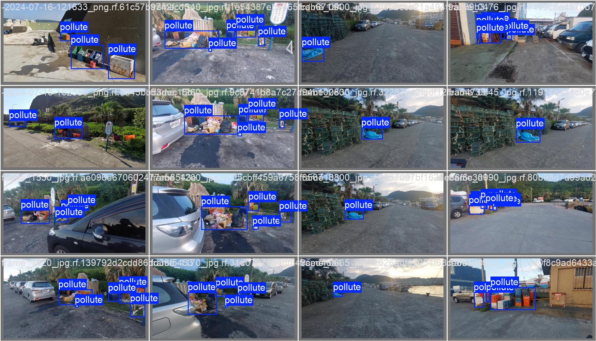
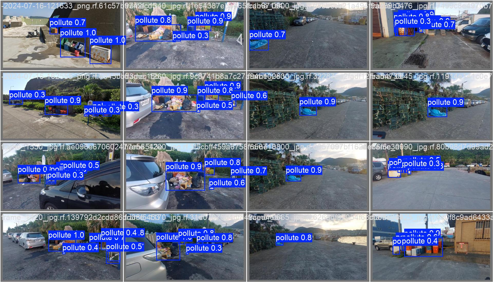

# yolo11_pollution
As title.

##  Training Records
1. epochs=10 batch=10 >>> train
2. epochs=20 batch=10 >>> train2
3. epochs=30 batch=10 device='mps' >>> train3 (211m 47.7s)

## Result

## Reference
* [Jung217/Waterside_Pollution_Dataset](https://github.com/Jung217/Waterside_Pollution_Dataset)
